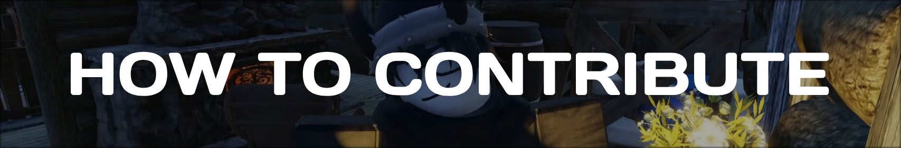

<h1 align="center">Learn how to contribute</h1>
<div align="center">
  
</div>

---

## Why contribute?

It is a good idea to contribute to the repository if you want to contribute challenges to the **BrawlDev community** and if you want to be listed in the contributors section.

> [!NOTE]
> It is important that you read the [RULES](#rules-for-contributing) and [CHALLENGES CODE FORMAT](#challenges-code-format) when making Pull Requests to avoid having your contribution cancelled.

---

## Rules for contributing

1. **DO NOT** modify the formatting/content of other challenges that do not belong to you. If you do this your contribution will be cancelled.
2. Try to **always follow the formatting code** for your challenges. If it is not followed, your contribution will be cancelled or you will be asked to follow it in order to be accepted.
3. If you are making a `Pull Request` in which you fix misspelled words or other things, avoid changing double quotes to single quotes, or avoid removing characters or other things that might mess up the code comparison of your `Pull Request`.
4. **DO NOT** add or change image names in the `./assets` folder, if you want to add something useful, let us know before in the description of your `Pull Request`.

> ⚠️ These rules may change as time progresses. ⚠️

## Challenges code format

```md
# Task

<!-- A detailed description of what the user has to do to successfully complete your challenge. -->

## Requirements

<!-- A list of the requirements that must be met to meet the challenge, for example: -->

- Make the code readable
- Use LUAU vanilla

## Topics Involved

<!-- A list of topics that are involved in your challenge, for example: -->

- metatables
- OOP
- Frameworks
- ect

## Extra Notes

<!-- Notes on your challenge, e.g. explaining things to watch out for   -->

## Extra Tasks

<!-- A list of extra tasks that SHOULD be accomplished in your challenge (may be optional) -->
```

> [!IMPORTANT]
> Please use this format in your `README.md` file to have a consistent repository and avoid confusion.
